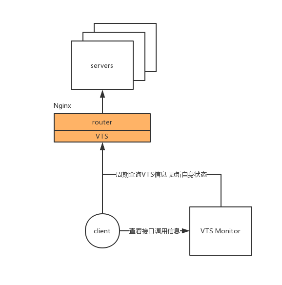

# VTS Monitor
[VTS](https://github.com/vozlt/nginx-module-vts)是一个Nginx第三方模块，可以统计到Nginx的流量、key的触发次数、集群的健康状态。该模块只提供了全量的统计，即从统计开始到当前时刻的所有数据。当希望获得服务的QPS、不同时间的服务器状态分布情况时，VTS就无能为力。`VTS Monitor`提供一个通用化方案，在一个VTS可用的情况下，通过简单的配置，就能获得服务器在不同时间的状态。

* 特征
    * 统计每分钟的接口调用次数
    * 获得指定某天的接口调用次数的时间分布, 粒度(天)

## 一、部署
### 1.环境及依赖:
* Linux
* Python3.x
* pip

### 2.虚拟环境初始化
```sh
$ pip install virtualenv
$ virtualenv --no-site-packages venv
$ source venv/bin/activate

# 在虚拟环境中安装依赖关系
(venv)$ pip install -r requirements.txt

# 退出虚拟环境
(venv)$ deactive
```

### 3.数据源更新脚本
接口调用的数据需要每分钟到vts进行获取和更新，以计算每个时间段的调用情况:
```sh
# 进行一次的数据源更新
(venv)$ cd update
(venv)$ python update_shelve.py

# 通过crontab进行定期触发
$ crontab -e

* * * * * cd <脚本路径> && <虚拟环境的python解释器> update_shelve.py
```

## 二、使用
目前使用非常简单， 提供了两个接口和相关的参数来获取需要的接口调用数据。

### 1.*接口的调用次数*
```sh
(GET) http://host:port/monitor/get

# 参数(urlencode)
key : <接口名>, 获得指定接口的调用次数, 若没有指明则会返回所有接口的调用次数
date : <日期>, 指明获得哪天的接口调用数据, 格式为:%Y-%m-%d

# 响应
响应上是各个时间段的调用次数, 时间段用时间戳stamp表示, 若希望获得格式化的显示可以使用`/monitor/get/pretty`接口
{
    "<key-name-1>" : [
        [<start-timestamp>, <end-timestamp>, <number>],
        [<start-timestamp>, <end-timestamp>, <number>],
        [<start-timestamp>, <end-timestamp>, <number>],
    ],
    "<key-name-2>" : [
        [<start-timestamp>, <end-timestamp>, <number>],
        [<start-timestamp>, <end-timestamp>, <number>],
        [<start-timestamp>, <end-timestamp>, <number>],
    ],
    ...
}

# DEMO
http://test.topbook.cc:5000/monitor/get?key=/monitor/user/profile
```
### 2.*获得请求名称*
```sh
(GET) http://host:port/monitor/keys

# 响应
[
    "<key-name-1>",
    "<key-name-2>",
    ...
]

# DEMO
http://test.topbook.cc:5000/monitor/keys
```

## 三、解决方案
### 1.*架构*
整个架构规划如下, 只要Nginx启用了VTS模块的功能，本方案即可定期查询VTS信息，将信息按时间增量方式进行计算。


### 2.*数据存储方案*
